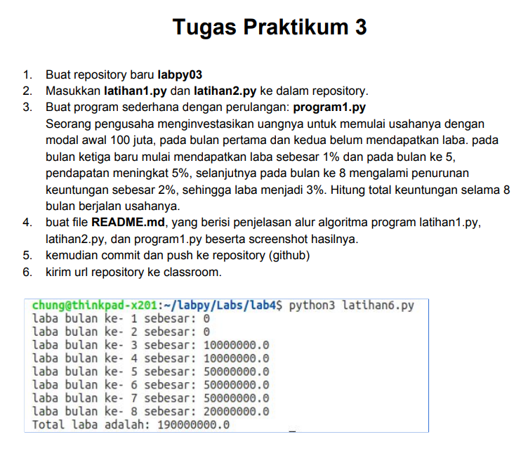
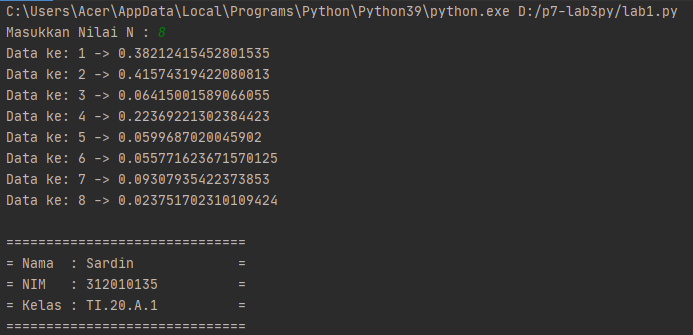
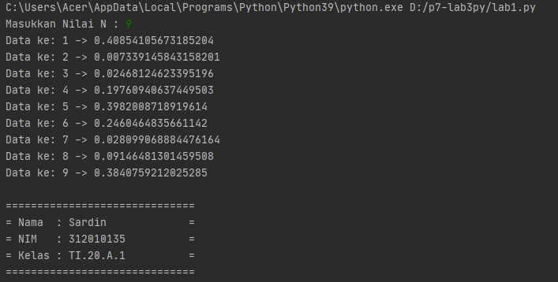
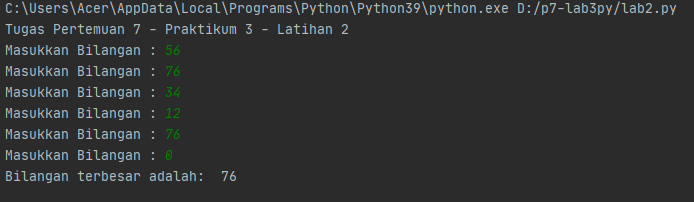

# Tugas Pertemuan 7 - Praktikum 3 - p7_lab3py
Repository ini dibuat untuk memenuhi Tugas Bahasa Pemrograman - Pertemuan 7 - Praktikum 3
<hr>

Pada pertemuan 7 ini saya diberi tugas oleh Dosen untuk mempelajari dan membuat program sederhana dengan Bahasa Pemrograman Python<br>

Nama : Sardin 
NIM : 312010135
Kelas : TI.20.A.1
<hr>

## Tugas Latihan 1

* Pada tugas kali ini saya diminta dosen untuk mengerjakan tugas **latihan1.py**, seperti gambar dibawah ini :<br>

 <br>

* Saya membuat source code dari perintah diatas (sesuai gambar), seperti dibawah ini :<br>
``` python

n=int(input("Masukkan Nilai N : "))

import random

for x in list(range(1, n+1, 1)):
    print(f"Data ke: {x} ->",random.uniform(0, 0.5))
``` 

Dari source code diatas akan saya jelaskan beberapa syntax atau function nya<br>
* Pada source code pertama, yaitu :<br>
``` python
import random
```
berfungsi untuk memasukkan *function random* yang ada didalam bahasa pemrograman python ke program yang telah saya buat.

* Untuk langkah kedua, penjelasan dari source code berikut :<br>
``` python
for x in list(range(1, n+1, 1)):
    print(f"Data ke: {x} ->",random.uniform(0, 0.5))
``` 

* Fungsi **for** disini sebagai bentuk perulangan, selain menggunakan **for** kita juga bisa menggunakan function *while*. Untuk kali ini saya menggunakan fungsi **for** pada program.<br>
Penggunaan syntax default for adalah :<br>
> for index in range(jumlahperulangan): <br>
>     perintah_yang_diulang

* Sedangkan untuk *function* range terdapat syntax default dari Python, seperti berikut :<br>
> range(start, stop, step_size)<br><br>
> Keterangan : <br>
> **start** -> Nilai Awal<br>
> **stop** -> Nilai Akhir<br>
> **step_size** -> Nilai Kenaikan<br><br>

* *Function list()* berfungsi untuk membuat hasil berupa daftar baris.<br>

* Fungsi **random.uniform()** adalah untuk menampilkan bilangan float random dengan batas awal bilangan, dan batas akhir bilangan.<br>
Pada fungsi ini penulisan syntax random.uniform() harus diisi dengan 2 niai dialam tanda kurung. Yaitu batas awal (Nilai Terendah). <br>

* Pada program tersebut saya menggunakan isi dalam fungsi *range(1, n+1, 1)*, Artinya : <br>
    1. Start saya menggunakan angka 1, karena saya ingin saat data dimuat/diproses dimulai dengan angka 1<br>
    2. Stop saya menggunakan **n+1**, Mengapa ada n? Karena n merupakan variable dari inputan yang user masukkan. Saya menggunakan +1 karena default pada fungsi stop di range adalah nilai itu juga. Misalnya kita memasukkan nilai stop 6, maka ketika angka 6 akan berhenti, jadi yang akan ditampilkan nilai 1-2-3-4-5. Nah angka 6 kan tidak ditampilkan, sedangkan kita menginginkannya menampilkan hasil 1-2-3-4-5-6. Dengan **n+1** lah fungsi itu akan berjalan.
    <br>
Hasil dari program tersebut seperti berikut :<br>
1. Saya ingin memampilkan 8 baris bilangan dengan nilai 0 sampai 0.5<br>


2. Saya ingin menampilkan 9 baris bilangan dengan nilai 0 sampai 0.5<br>


## LATIHAN 2
<hr>

Saya akan melakukan pengerjaan selanjut nya yaitu latihan 2 dengan syntax seperti ini.
```` python
# Praktikum 3 - Latihan 2 - Pertemuan 7

print("Tugas Pertemuan 7 - Praktikum 3 - Latihan 2")

xangka=0
while True:
    xbilangan = int(input("Masukkan Bilangan : "))
    if (xangka < xbilangan):
        xangka=xbilangan
    if (xbilangan == 0):
        break

print("Bilangan terbesar adalah: ",xangka)
print()
````
<br>

Untuk mengerjakan soal diatas maka kita perlu memasukan atau menginput datanya terlebih dahulu atau setelah itu bisa dilihat data yang akan dijalankan dengan syntax diatas.
Dan untuk melihat hasil menjalankan syntx diatas dan kita bisa menginput nilai seperti berikut.<br>




